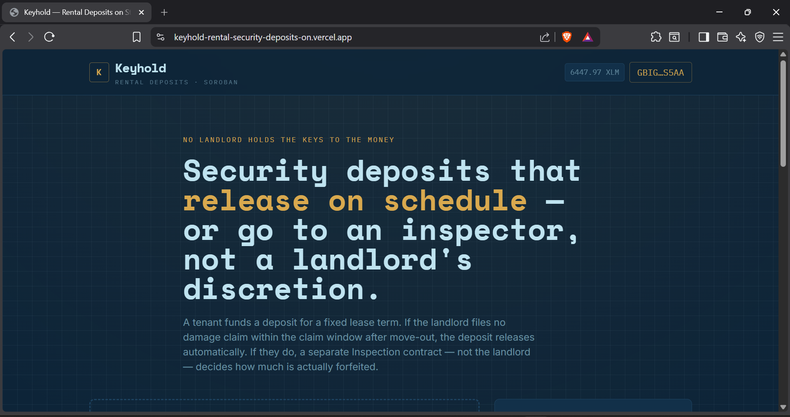
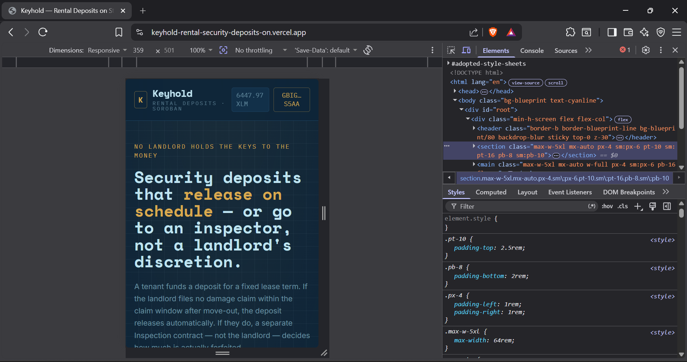
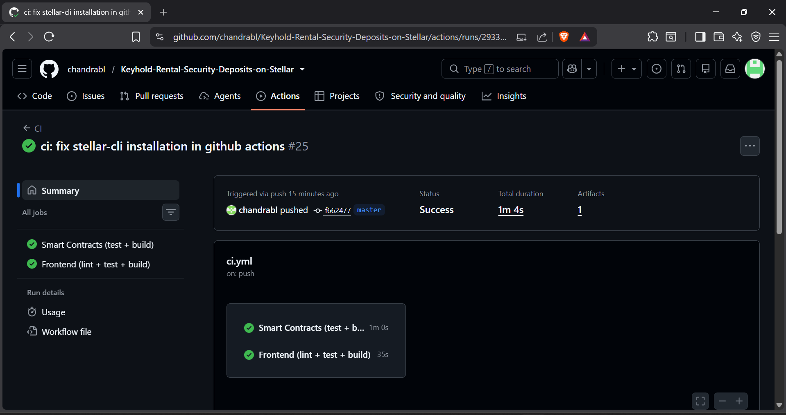
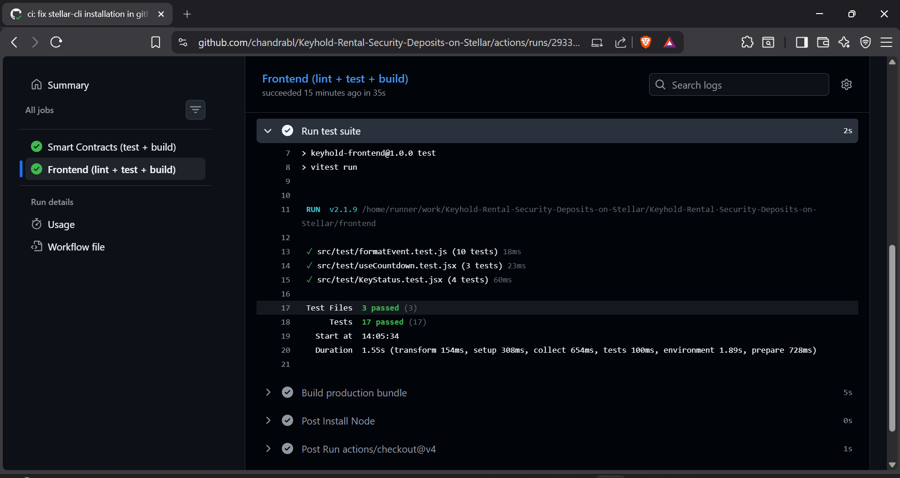

  
# 🗝️ Keyhold - Rental Security Deposits on Stellar

**An on-chain rental deposit manager built on Soroban smart contracts.**  
*Keyhold replaces landlord discretion with a time-gated release system and an independent Inspection contract that rules on damage claims.*

### 🔗 [▶️ Live App](https://keyhold-rental-security-deposits-on.vercel.app/) &nbsp;|&nbsp; [🎥 Video Demo](https://drive.google.com/file/d/14lJop4gI0MdJvNOsiCDinCCiUTNWEEQD/view?usp=sharing)

 

## 🌟 Key Features

1. **Time-Gated Auto-Release:** If the landlord files no damage claim within the claim window after the lease ends, the deposit auto-releases to the tenant — no landlord discretion required.
2. **Independent Arbitration:** A landlord being the sole judge of their own damage claim is a structural conflict of interest. If a claim is filed, a separate Inspection contract — not the landlord — rules on how much is actually forfeited.
3. **Real-time Event Streaming:** Every step emits an event, streamed live into the frontend's case log. A live per-lease countdown shows exactly when the lease ends and when the claim window closes, ticking down against on-chain timestamps.
4. **Decentralized Escrow:** Deposits are locked securely on the Stellar blockchain, ensuring neither the landlord nor the tenant can tamper with the funds outside of the agreed-upon rules.

---

## 🚀 Smart Contract Deployment (Stellar Testnet)

The smart contracts are live and deployed to the **Stellar Testnet** via automated CI/CD (GitHub Actions).

| Contract | Contract ID | Explorer |
|---|---|---|
| 🏦 **Deposit** | `CAPKWITBW4DML7VDN2OXWDCRHZ7VWVATSJ3PTOFSL6KB42WE3GM5AT5B` | [View on Stellar Expert](https://stellar.expert/explorer/testnet/contract/CAPKWITBW4DML7VDN2OXWDCRHZ7VWVATSJ3PTOFSL6KB42WE3GM5AT5B) |
| 🔍 **Inspection** | `CDXB4HBJR7XNTFDNMEREE5WSPYOJYMKCLTB32FDY4JAARWSBCVC72FO6` | [View on Stellar Expert](https://stellar.expert/explorer/testnet/contract/CDXB4HBJR7XNTFDNMEREE5WSPYOJYMKCLTB32FDY4JAARWSBCVC72FO6) |

### 🔗 Transaction Example
**Deposit Funded / Contract Interaction:**  
[`cfd7190c174d2b845d69a5d8e459186052cfcbf57fdab1132662ba1d9b156859`](https://stellar.expert/explorer/testnet/tx/cfd7190c174d2b845d69a5d8e459186052cfcbf57fdab1132662ba1d9b156859)

---

## 🏗️ Architecture

Keyhold treats the deposit contract and the claims-adjudication contract as genuinely separate systems: Deposit never decides *how much* is forfeited, it only knows how to ask Inspection for a ruling — by dollar amount, not a fixed status — and execute whatever split comes back. It also leans on Soroban's on-chain ledger timestamp for real time-gating (lease end, claim window) rather than any off-chain clock.

1. **Landlord drafts lease terms** — tenant, token, deposit amount, lease end date, and a claim window (how long after lease end they have to file a claim).
2. **Tenant reviews and funds** the deposit, activating the lease.
3. **At lease end**, if the landlord files no claim within the window, **anyone** can call `release_deposit` to return the full deposit to the tenant.
4. **If the landlord files a claim** instead (with a claimed amount and reason), it escalates to the Inspection contract via a cross-contract call.
5. **A trusted inspector rules** on how much of the claimed amount is justified.
6. **Anyone can call `settle_claim`** afterward — it reads the ruling back from Inspection and splits the deposit: the ruled amount to the landlord, the remainder back to the tenant.

See [ARCHITECTURE.md](./ARCHITECTURE.md) for the full diagram and event table.

---

## 🛠️ Tech Stack

| Layer | Choice |
|---|---|
| **Smart Contracts** | Rust + Soroban SDK 21 |
| **Token Standard** | SEP-41 (Stellar Asset Contract compatible) |
| **Frontend** | React 18 + Vite + Tailwind CSS |
| **Wallet** | Freighter |
| **Testing** | `cargo test` (contracts), Vitest + Testing Library (frontend) |
| **CI/CD** | GitHub Actions |
| **Hosting** | Vercel |

---

## 📸 Screenshots

### Product UI

### Mobile Responsive UI

### CI/CD Pipeline

### Test Output (3+ passing tests)

---

## 💻 Running Locally

### Contracts

`ash
rustup target add wasm32-unknown-unknown
cargo test --workspace
cargo build --release --target wasm32-unknown-unknown
`

### Frontend

`ash
cd frontend
npm install
npm test
npm run lint
npm run dev
`

By default the frontend runs with no contract addresses configured and shows a clear banner saying so — see [DEPLOYMENT.md](./DEPLOYMENT.md) for deploying your own instance to testnet.

---

## ✅ Submission Checklist

- [x] Public GitHub repository
- [x] README with complete documentation
- [x] Minimum 10+ meaningful commits
- [x] Live demo link (Vercel)
- [x] Contract deployment address
- [x] Transaction hash for contract interaction
- [x] Screenshot showing: Mobile responsive UI
- [x] Screenshot showing: CI/CD pipeline running
- [x] Screenshot showing: Test output with 3+ passing tests
- [x] Demo video link (1–2 minutes)
